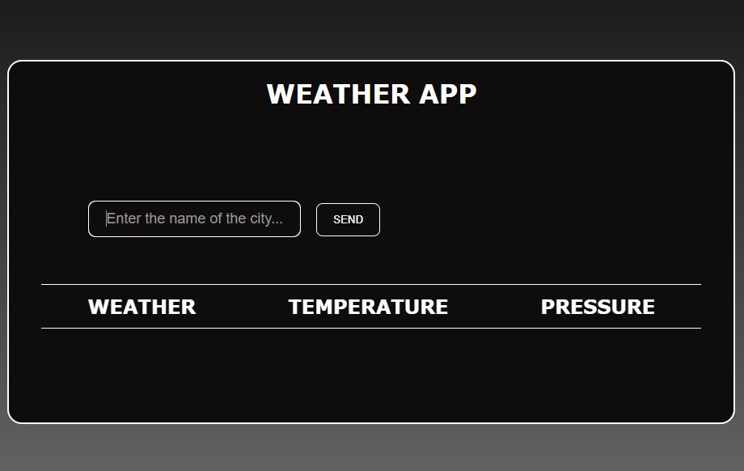
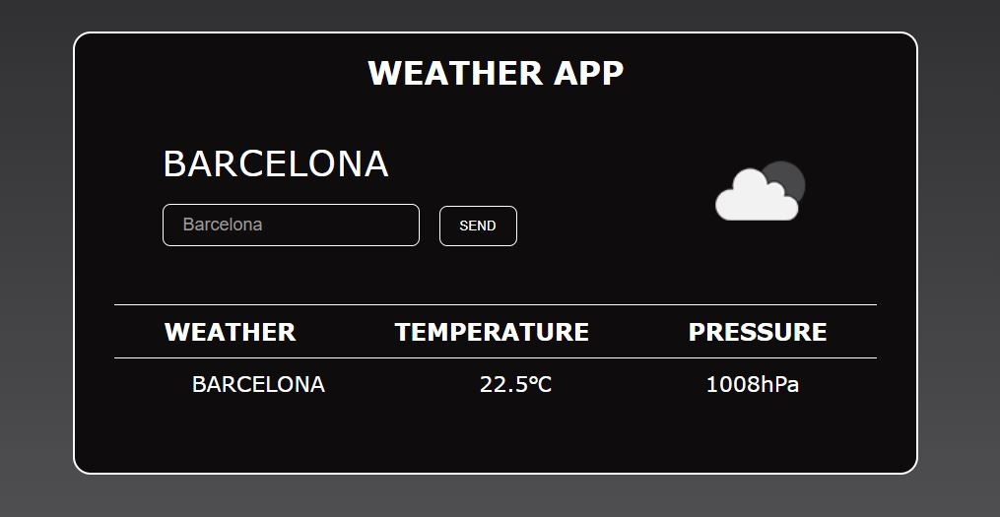

# WeatherApp
WeatherApp is an application that allows you to search for information on weather conditions for a particular city. 
The temperature and pressure information is retrieved via an API from the website: https://openweathermap.org

You can see this project here: https://szymonsauer.github.io/weather-app/

* [General info](#general-info)
* [Technologies](#technologies)
* [Screenshots](#screenshots)
* [Setup](#setup)
* [Status](#status)
* [Inspiration](#inspiration)

## General info
I made this project to practice my skills related to JavaScript and web creating. 

## Technologies
Project is created with:
* HTML5
* CSS3
* JavaScript

## Screenshots

## Setup
You can see this project on-line using link: https://szymonsauer.github.io/weather-app/
To run this project locally download the code and run in the Visual Studio Code program. 

## Status
Project is completed
